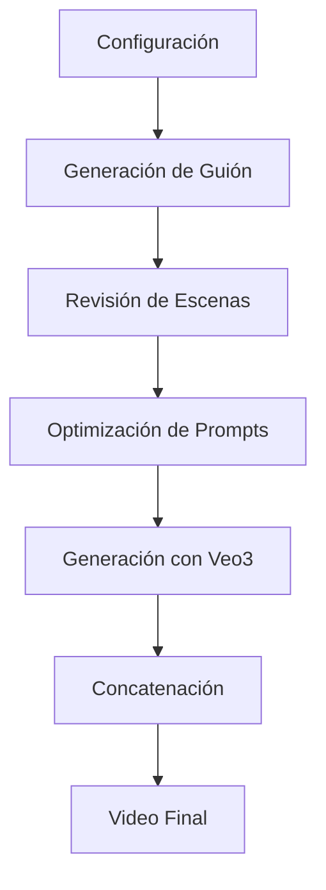

# 🎬 StoryCraft

**StoryCraft** es una aplicación de inteligencia artificial que transforma ideas en videos cinematográficos completos. Utilizando tecnología de vanguardia, genera automáticamente guiones, optimiza prompts y crea videos de alta calidad.

## ✨ Características Principales

- 🤖 **Generación automática de guiones** con OpenAI GPT-4
- 🎯 **Optimización inteligente de prompts** para cada escena
- 🎬 **Generación de videos HD** con KieAI Veo3
- 📱 **Interfaz moderna y responsiva** con Next.js 14
- ⚡ **Procesamiento en tiempo real** con indicadores de progreso
- 🎨 **Personalización completa** de objetivos, tono y estilo
- 📊 **Sistema de escenas** con duración configurable
- 🔄 **Concatenación automática** de videos finales

## 🚀 Tecnologías Utilizadas

### Backend
- **Next.js 14** - Framework de React con App Router
- **TypeScript** - Tipado estático para mayor confiabilidad
- **OpenAI GPT-4** - Generación de guiones inteligentes
- **KieAI Veo3** - Generación de videos de alta calidad

### Frontend
- **React 18** - Biblioteca de interfaz de usuario
- **Tailwind CSS** - Framework de estilos utilitarios
- **Lucide React** - Iconografía moderna
- **Zustand** - Gestión de estado global

### APIs y Servicios
- **OpenAI API** - Procesamiento de lenguaje natural
- **KieAI Veo3 API** - Generación de videos cinematográficos
- **Next.js API Routes** - Endpoints del servidor

## 🛠️ Instalación

### Prerrequisitos
- Node.js 18+ 
- npm o yarn
- API Keys de OpenAI y KieAI

### Pasos de instalación

1. **Clonar el repositorio**
```bash
git clone https://github.com/tu-usuario/storycraft.git
cd storycraft
```

2. **Instalar dependencias**
```bash
npm install
```

3. **Configurar variables de entorno**
```bash
# Crear archivo .env.local
OPENAI_API_KEY=tu_openai_api_key
KIEAI_API_KEY=tu_kieai_api_key
AIMLAPI_KEY=tu_aiml_api_key_opcional
```

4. **Ejecutar en desarrollo**
```bash
npm run dev
```

5. **Abrir en el navegador**
```
http://localhost:3000
```

## 📋 Uso

### 1. Configuración del Proyecto
- Define el **objetivo** de tu video
- Selecciona el **tono** (profesional, casual, dramático, etc.)
- Elige el **estilo visual** deseado
- Configura la **duración** (8, 16, 24 o 32 segundos)

### 2. Generación del Guión
- El sistema genera automáticamente escenas coherentes
- Cada escena está optimizada para 8 segundos
- Puedes revisar y editar el guión generado

### 3. Creación de Videos
- Los prompts se optimizan automáticamente para Veo3
- Seguimiento en tiempo real del progreso por escena
- Generación en calidad 1080P HD

### 4. Resultado Final
- Video final concatenado automáticamente
- Descarga individual de escenas
- Información completa del proyecto

## 🎯 Flujo de Trabajo



## 🔧 Configuración de APIs

### OpenAI API
- Utilizada para generación de guiones
- Requiere modelo GPT-4 o superior
- [Obtener API Key](https://platform.openai.com/api-keys)

### KieAI Veo3 API
- Generación de videos de alta calidad
- Soporte para 1080P HD
- Tiempos de generación: 1-2 minutos por escena
- [Obtener API Key](https://kie.ai/api-key)

## 📊 Especificaciones Técnicas

### Formatos de Video
- **Resolución**: 1080P HD
- **Duración por escena**: 8 segundos fijos
- **Relación de aspecto**: 16:9 (configurable)
- **Formato**: MP4 con marca de agua

### Limitaciones
- Máximo 4 escenas por proyecto (32 segundos total)
- Prompts limitados a 2000 caracteres
- Videos almacenados por 14 días en KieAI

## 🚀 Despliegue

### Vercel (Recomendado)
```bash
npm run build
vercel --prod
```

### Docker
```bash
docker build -t storycraft .
docker run -p 3000:3000 storycraft
```

### Variables de Entorno en Producción
- `OPENAI_API_KEY`
- `KIEAI_API_KEY`
- `AIMLAPI_KEY` (opcional)

## 🤝 Contribución

1. Fork el proyecto
2. Crea una rama para tu feature (`git checkout -b feature/AmazingFeature`)
3. Commit tus cambios (`git commit -m 'Add some AmazingFeature'`)
4. Push a la rama (`git push origin feature/AmazingFeature`)
5. Abre un Pull Request

## 📝 Licencia

Este proyecto está bajo la Licencia MIT. Ver `LICENSE` para más detalles.

## 🙏 Agradecimientos

- **OpenAI** por GPT-4 y tecnologías de IA
- **KieAI** por la API de Veo3
- **Vercel** por el hosting y despliegue
- **Next.js** por el framework

## 📞 Soporte

- 📧 Email: soporte@storycraft.ai
- 💬 Discord: [Servidor de la Comunidad](https://discord.gg/storycraft)
- 📚 Documentación: [docs.storycraft.ai](https://docs.storycraft.ai)

---

**StoryCraft** - Transforma tus ideas en videos cinematográficos con IA 🎬✨ 